# TrsData上传与下载教程

## 目录

- [目录](##目录)
- [下载单个文件](##下载单个文件)
- [共享翻译文件](##共享翻译文件)
  - [用户上传](###用户上传)
  - [管理员维护](###管理员维护)
- [常见问题](##常见问题)
- [参考资料](##参考资料)

## 下载单个文件

在新版本Github中，可以方便的下载单个文件。

首先点击你要下载的文件，以`README.md`为例。点击该文件

点击即可下载。
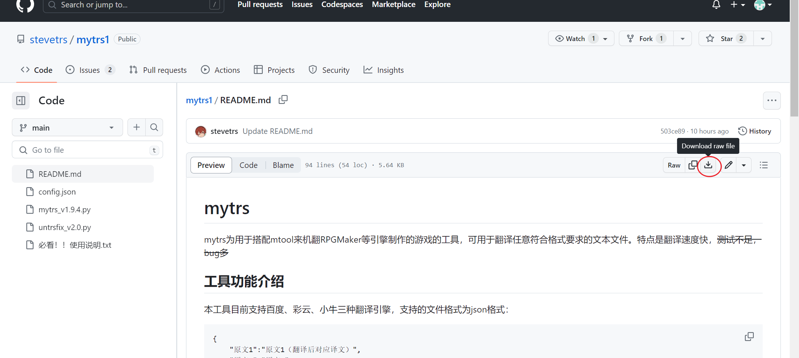

## 共享翻译文件

本章介绍如何使用Github的Pull Requests功能，来共享`TrsData.bin`文件。

### 用户上传

本流程需要你有一个Github账号。主要流程为：

1. fork本仓库。
2. 加入你的文件。
3. 提交Pull Requests，请求将文件合并到本仓库中。

为了上传文件，我们首先需要fork这个仓库，这将本仓库复制一份放入你的个人空间中。

1. 点击红圈处进行fork：
   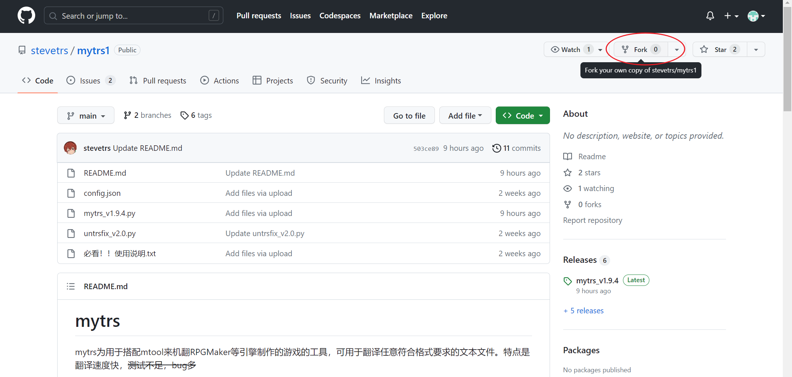
2. 你可以修改fork后该仓库的仓库名以及描述，推荐不更改。
   点击红圈处，完成fork
   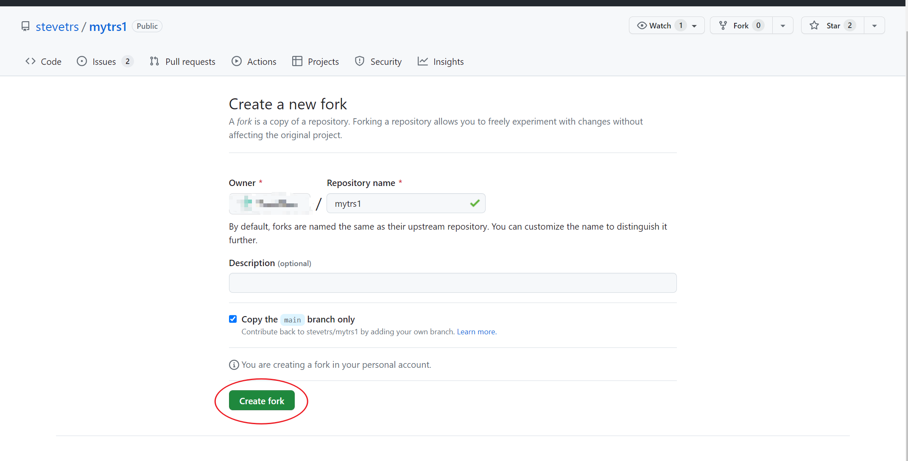
3. 等待一段时间（自测3秒）即可
   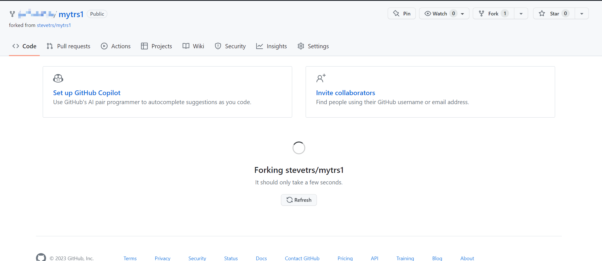

接下来我们将上传自己的文件。

希望使用git来上传文件的用户有能力自行完成这件事，不会来看本教程。
这里主要介绍在网站上使用图形化界面上传文件。

1. 在自己fork的仓库中（确认绿框中是否为自己的账号名），点击TrsData文件夹
   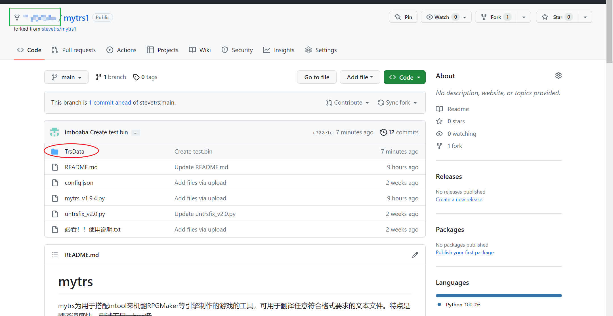

2. 先点击`Add file`，然后点击`Upload files`。
   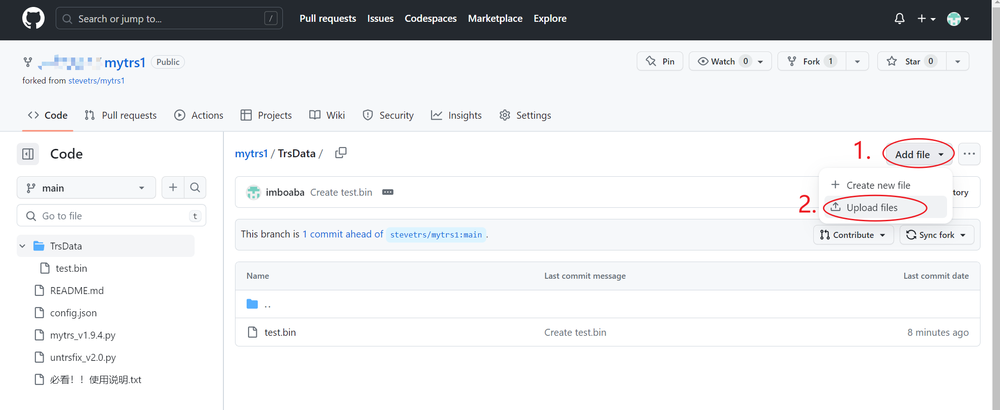

3. 在此页面添加你的文件、你本次添加的文件的描述、以及一些额外的注释（可选）
   请尽量描述清楚你的翻译文件，方便管理员汇总。

   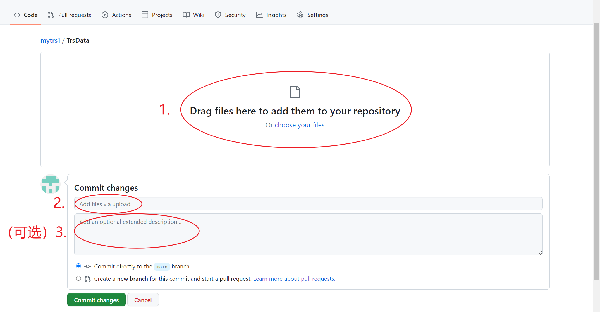

4. 操作完成后的样子参考下图。点击Commit changes提交文件
   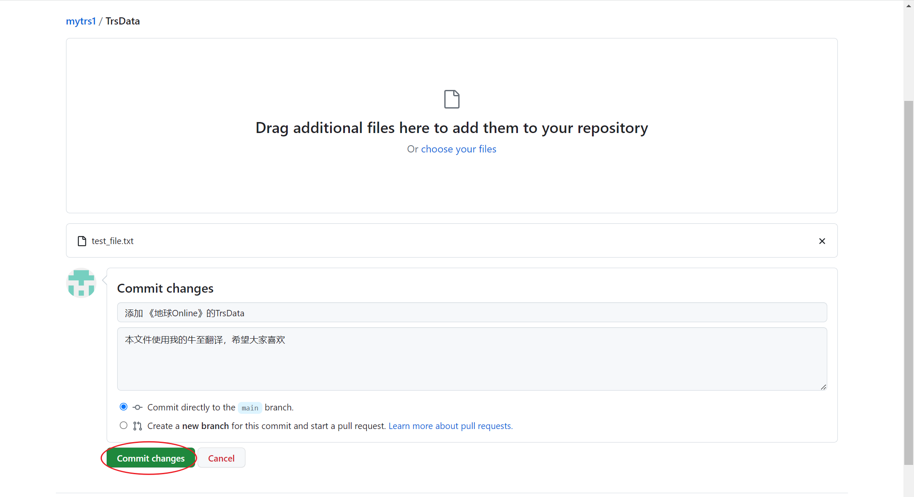

最后，我们需要你将本次的更改合并到主仓库中。

1. 同样是在你的仓库界面，点击Pull requests
   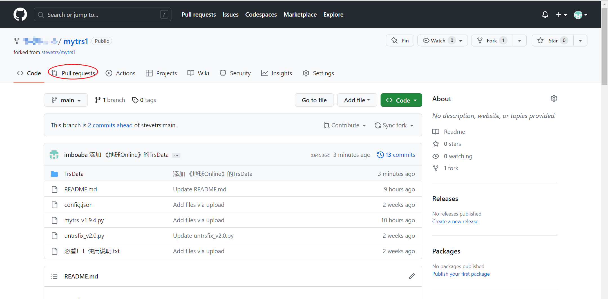
2. 点击New pull requests
   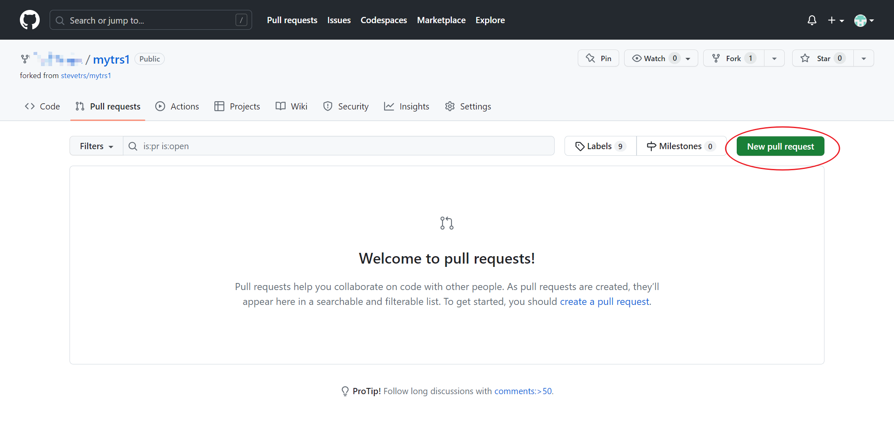
3. 请在红框处确认信息是否正确。确认无误后点击Create pull requests
   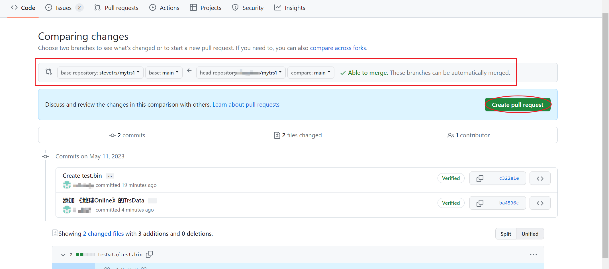
4. 请填写相关信息，填写完毕后点击Create pull requests提交
   
5. 请记得确认管理员是否同意提交。若需要完善一些资料，请见[参考资料](##参考资料)中的Pull Request流程

### 管理员维护

本小节借用[参考资料](##参考资料)中Pull Request流程的图片（因为我没得图可以截）。

管理员会在仓库界面看到Pull requests的通知，点击即可查看具体内容。
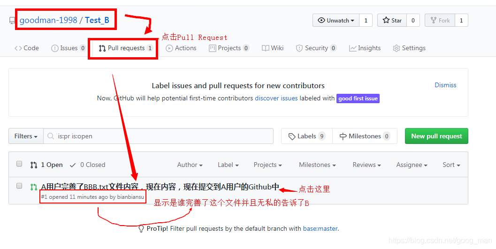

对于一个Pull requests通常会有三种操作：

1. 如果你对本次提交的内容很满意，你可以将本次的内容同步到你的仓库中。
   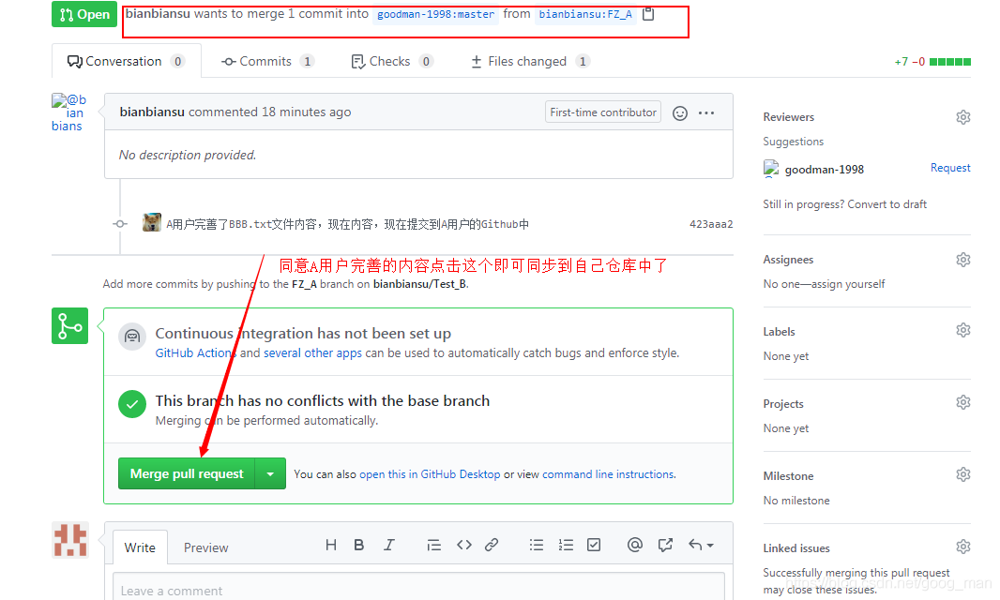
2. 如果觉得本次提交的内容还行，但是需要对方提供详细的游戏名、翻译网站等信息，可以发送commit等待其改进。
   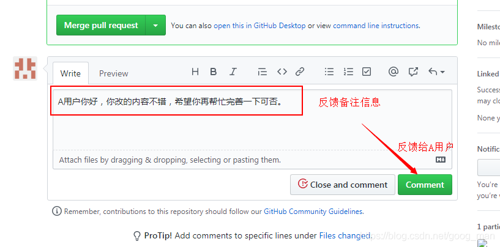
3. 如果你发现本次提交是在捣乱，可以关闭本次提交
   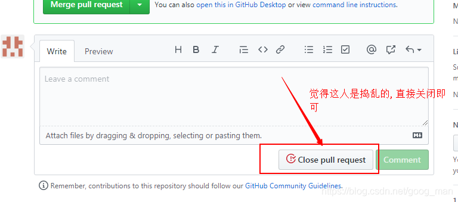

## 常见问题

Q：我之前上传过文件，这次还想上传文件，却发现fork不了了
A：（比较省事的方法）请在你的个人仓库中，删除上次的fork过的本仓库，然后重新操作

Q：管理员不通过我的Pull requests
A：可能是你的文件描述不清楚。

Q：想看stevetrs女装（？）
A：我也想🥵🥵

## 参考资料

[Pull Request流程](https://blog.csdn.net/goog_man/article/details/106901045)

[Github中的fork是什么](https://zhidao.baidu.com/question/1707079663506155380.html)

